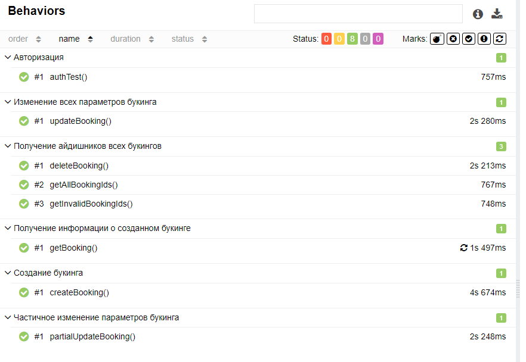

# This is API Autotest for [restful-booker.herokuapp.com](https://restful-booker.herokuapp.com/)

Made with Java/RestAssured/Allure/Lombok/jackson

If you want to see how they work, open them, you should [open](https://github.com/KonKerQA/ApiTestsRestfulBooker.git)
them in your IDE and press start button in PSTUTests class
OR Run the command "gradle clean test" in the terminal of your IDE.

The screenshot below shows how test results appear in the Allure report.
The time to run all tests is 13-16 seconds.

